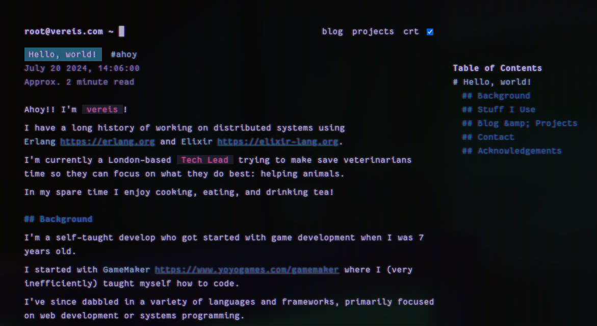

# 🚀 vereis's Blog

This is my personal blog where I write about Elixir, functional programming, and whatever else I feel like sharing.

It's built to be relatively minimal and easy to extend.



I built this as a real-world example of how I like to structure Elixir projects, namely:

- Using Umbrella apps to split responsibilities
- Sharing my structure for Ecto schema layouts and query building
- Demonstrating how I like to have my context functions

## 🛠️ Getting Started

This project can be run with or without Nix! Environment variables are stored in `.env` for easy setup.

### Setup with Nix + Direnv (recommended):
```bash
cd blog/  # direnv automagically sets everything up
docker-compose up -d # Start Postgres
mix deps.get
mix lint
mix test
iex -S mix phx.server
```

### Setup with Nix (without direnv):
```bash
cd blog/
nix develop
source .env  # Load environment variables
docker-compose up -d
mix deps.get
mix lint
mix test
iex -S mix phx.server
```

### Setup without Nix (using [asdf](https://asdf-vm.com/)):
Make sure you have the versions specified in `.tool-versions`:
- Elixir 1.18.3-otp-27
- Erlang 27.3.4
- Node.js 20.18.1

```bash
cd blog/
# Install versions with asdf
asdf install

# Load environment variables
source .env

# Install system dependencies (varies by OS):
# - SQLite
# - Docker + Docker Compose

docker-compose up -d
mix deps.get
mix lint
mix test
iex -S mix phx.server
```

Then head over to `http://localhost:4000` 😎

## 🏗️ Architecture (The Fun Stuff)

This is a **Phoenix Umbrella app**.

### The `blog` App - Where the Magic Happens ✨

This is the place where the majority of my blog's business logic lives.

- **Dual database support** using SQLite for in-memory, low latency reads for posts and images. Postgres for comments, background jobs, write heavy workflows.
- **A filesystem watcher** that automatically loads data into a schema's configured database on filesystem change.
- **Real-time updates** so that drafting blog posts is painless.

#### The Resource System

I built a generic "resource" pattern that's pretty neat:

- **Drop markdown files** with YAML frontmatter into `priv/posts/` and boom, they become blog posts
- **Toss images** into `priv/images/` and they get automatically optimized into WebP format
- **Everything hot-reloads** during development - change a file, see it instantly.

Each resource type implements a `Blog.Resource` behavior, so adding new content types is straightforward.

I plan on adding recipes, videos, etc in the future using this.

#### Comprehensive Markdown Processing

I use **MDEx** for parsing because:

- **Syntax highlighting** just works across numerous languages automagically with no frontend dependencies.
- **GHF Markdown** so tables and other extensions just work.

This dependency is built in Rust, so setting up compilation was a little finnicky but it's super fast compared to the pure Elixir alternatives too.

#### Image Processing Like a Pro

Powered by **Vix** (which wraps the libvips):

- **Automatic WebP conversion** at 80% quality on image import. This could be made configurable in future.
- **Database storage** because SQLite is good enough at this scale. I've survived two HN hugs of death without sweating!

In the future, I plan on updating this resource to automatically generate entirely backend driven LQIP's too!

### The `blog_web` App - The Pretty Face 💄

This is where Phoenix LiveView shines like the real-time star it is:

- **One LiveView to rule them all** - `BlogWeb.BlogLive` handles everything with different "live actions"
- **Live Search** just works thanks for SQLite's super easy to use FTS extension.
- **Tag filtering** that doesn't require page reloads or JavaScript.

#### The Route Lineup:
- `/` - Homepage, shows my oldest post (which is a generic "about me").
- `/posts/` - All the posts with search and filtering goodies
- `/posts/:slug` - Individual posts with auto-generated TOCs
- `/projects/` - Where I show off my other questionable decisions
- `/rss` - For the RSS purists, I don't use RSS but I've been asked to implement this a few times.
- `/assets/images/:name` - Optimized image serving that's fast as lightning

## 🎯 Why I Built It This Way

**File-based authoring** because I write in markdown and want to keep dependencies minimal.

**SQLite as the primary database** because it's stupidly fast if you're not trying to do write heavy workflows.

**Real-time everything** because page refreshing is so 2010.

## 🚀 Deployment & CI/CD

GitHub Actions handles testing and deployment to Fly.io.

### Workflows

**CI** (`.github/workflows/ci.yml`) - Runs on PRs:
- `mix lint` and `mix test`

**Deploy** (`.github/workflows/deploy.yml`) - Runs on main branch:
- Same lint/test steps, then deploys to Fly.io

### The `mix lint` Command

I consolidate all code quality tools into one command:

- **[Styler](https://github.com/adobe/styler)** - Opinionated code formatting beyond `mix format`
- **[Credo](https://github.com/rrrene/credo)** - Static analysis for design issues  
- **[Dialyzer](https://www.erlang.org/doc/man/dialyzer.html)** - Type checking and discrepancy detection

Check the `lint` alias in `mix.exs` to see how they're chained together.

### Deployment

Deploys to Fly.io using Docker. The umbrella release includes both apps in a single container.

---

*This blog is built with ❤️, lots of ☕, and probably too much ⏰ spent tweaking CSS animations. Issues and PRs welcome, but please be nice - my feelings are surprisingly fragile for someone who chose to work with computers.*
